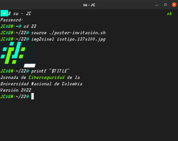
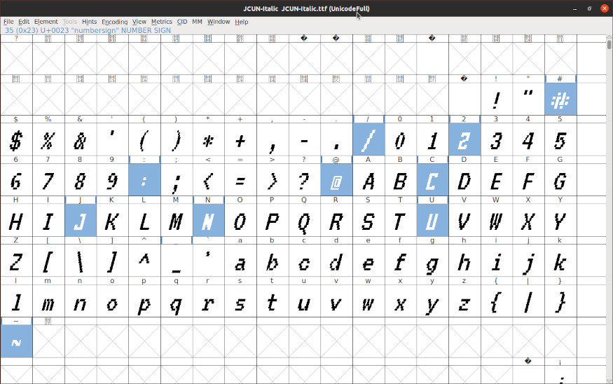

# ¿Qué es esto?
Es un repositorio que contiene los recursos necesarios para configurar la terminal *XTerm* para hacer piezas gráficas o audiovisuales (posters) directamente con la *Bash*. 



Se necesita de
1. El emulador de terminal XTerm
2. Grabador de pantalla OBS Studio
3. Editor de video Inshot (con Anbox)

# Configuración

Probado en Ubuntu 20.04.4 LTS
1. Fuente tipográfica `fc-match JCUN:style=Italic`
2. Personalización el emulador del terminal *XTerm* `xrdb -q`
3. Prompt de bash `echo $PS1`
4. Instalar img2sixel `img2sixel -V`

# Fuente tipográfica

1. Descargar fuente *JCUN-Italic* de https://drive.google.com/file/d/1X_0mWgabwO54IWNtCmVsaIoNUWJtSGFE/view?usp=sharing
2. Instalar la fuente o copiarla a `~/.local/share/fonts` 
3. Correr `sudo fc-cache -f`
4. Verificar
```bash
fc-match JCUN:style=Italic
```
```bash
JCUN-Italic.ttf: "JCUN" "Italic"
```



*Nota:* esta fuente es una modificación no autorizada de las fuentes [VT323](https://fonts.google.com/specimen/VT323), [Fire Code](https://fonts.google.com/specimen/Fira+Code) y [MesloLGS NF](https://github.com/romkatv/powerlevel10k-media/blob/master/MesloLGS%20NF%20Regular.ttf). *VT323* provee los caracteres alfanuméricos básicos (adaptados) en los cuales los caracteres `JC@UN:~/22#_` se han modificado para replicar el logotipo de [JCUN22](https://uqbarunal.github.io/JC@UN:~/22#). *Fire Code* provee los caracteres para [dibujo de cajas](https://www.w3.org/TR/xml-entity-names/025.html). Y finalmente *MesloLGS NF* provee caracteres
# Personalización el emulador del terminal XTerm
## Instalación
Se asume que se ha instalado Xterm

## Personalización
1. En `vim ~/.Xresources`
```
*customization: -color
XTerm.vt100.faceName: JCUN:style=Italic
XTerm.vt100.faceSize: 18
XTerm.vt100.background: rgb:1e/1e/1e
XTerm.vt100.color0: rgb:1e/1e/1e
XTerm.vt100.color2: rgb:70/ff/00
XTerm.vt100.color4: rgb:0/ff/d1
XTerm*decTerminalID: vt340
XTerm*numColorRegisters: 256
```
2. Luego `xrdb ~/.Xresources`
3. Comprobamos con `xrdb -q`
4. Finalemnte `xterm`

Es posible aumentar el tamaño de la fuente con la bandera `fs`
```bash
xterm -fs 25
```

*Nota:* XTerm no soporta emojis
# Prompt de bash
Exportar esta variable a tu sesión de Bash
```bash
PS1='\[\033[32m\]JC\[\033[34m\]@\[\033[32m\]UN:\[\033[00m\]\w\[\033[34m\]# \[\033[00m\]'
```
Se recomienda salvar el valor de la variable original (que está `.bashrc`) antes de hacerla persistente. [¿Como crear variables de entorno globales persistentes?](https://platzi.com/tutoriales/1748-terminal/9232-como-crear-variables-de-entorno-globales-persistentes/)

# Instalar img2sixel
```bash
sudo apt install libsixel-bin
```
[Manual de img2sixel](https://github.com/saitoha/libsixel#img2sixel)
